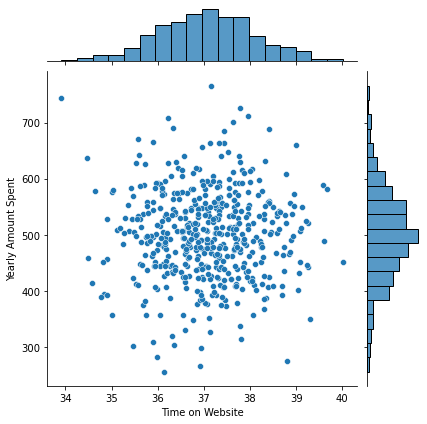
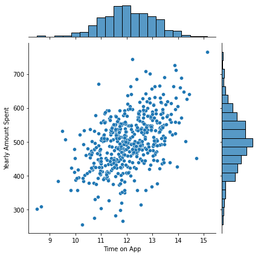
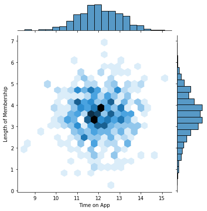
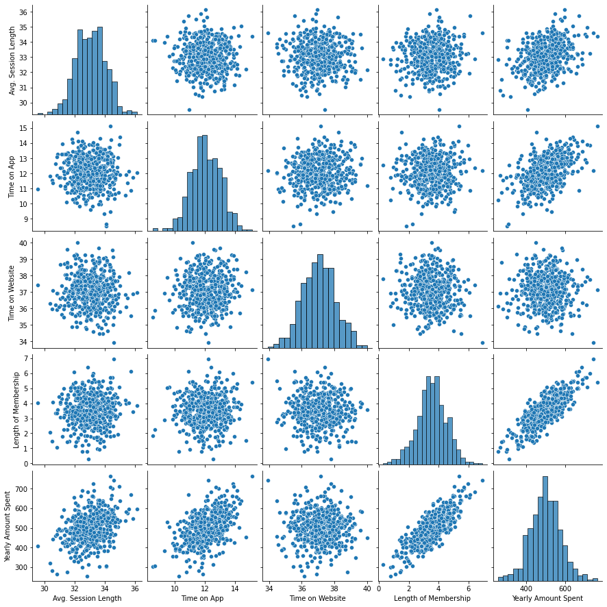
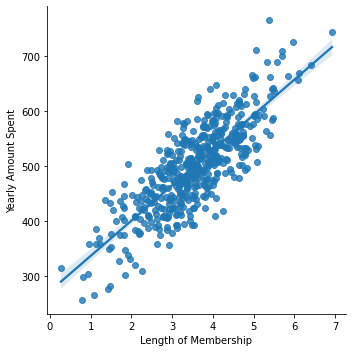
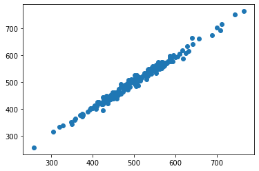

#  Ecommerce analysis
Creating a linear regression model to find insights about which numerical metrics inlfuence purchase.

## The dataset
The dataset (csv document in this folders) includes the following numerical values:
- Avg. Session Length: Average session of in-store style advice sessions.
- Time on App: Average time spent on App in minutes
- Time on Website: Average time spent on Website in minutes
- Length of Membership: How many years the customer has been a member.

The target value is Yearly Amount Spent

## Exploratory analysis

At first, I'm exploring which numerical values have a stronger correlation with Yearly Amount Spent.

Some of the generated plots are:

By running a Searborn pairplot, it's noticeable that "Length of Membership" has a strong correlation with our target value.

Using the Searbon lmplot, we can take a look at the regression model with such subset:

## Training and Testing Data

I've removed all non-categorical data (such as Avatar, email, etc.) and Created 2 subsets:
- X array: Contains the features to train on
- y array: Contains the target variable (Yearly Amount Spent)

Afterwards, I ran a [train-test-split from SciKitLearn](https://scikit-learn.org/stable/modules/generated/sklearn.model_selection.train_test_split.html) on the data. The model will be trained with the X array, which we'll compare to the y array to evaluate the model.

## Predictions

I've used the in-built function from SciKitLearn to run the predictions.
In order to check if the predictions make sense, they are plotted against the test set (y_test):

## Evaluating the Model

In order to evaluate the model, I've calculated the following model erros:
- MAE: 7.742671285838737
- MSE: 93.83297800820057
- RMSE: 9.68674238370158

## One last look

At last, we can take a look at the following correlation coefficients:

| Unit Metric | Coefficient |
| ------ | ------ |
| Avg. Session Length | 25.981550 |
| Time on App | 38.590159 |
| Time on Website | 0.190405 |
| Length of Membership	 | 61.279097 |

Based on these relationships, we can draw insights about the return on investment on web development, app development, and retention.

## Libraries Used

| Name | Library |
| ------ | ------ |
| Pandas | https://pandas.pydata.org/ |
| Matplotlib | https://matplotlib.org/ |
| Seaborn | https://seaborn.pydata.org/ |
| SciKitLearn | https://scikit-learn.org/stable/ |